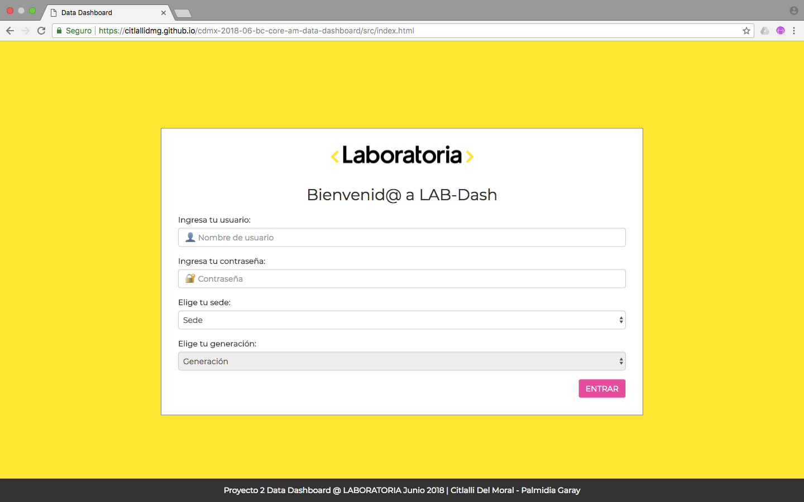
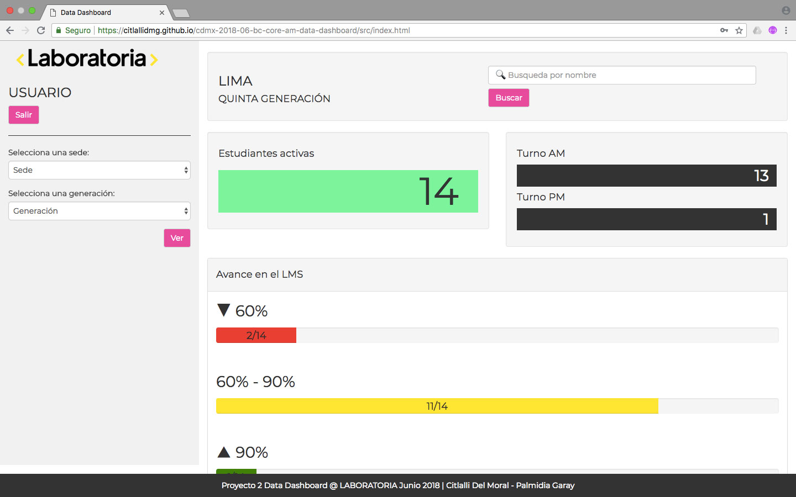
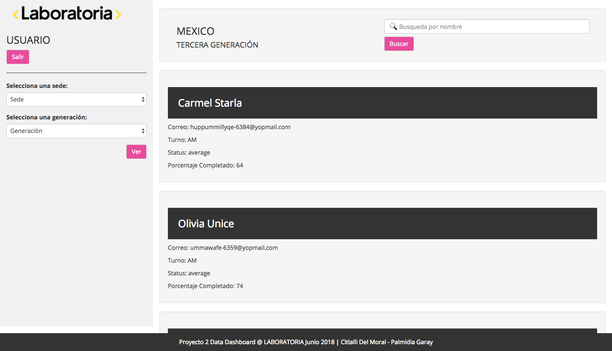
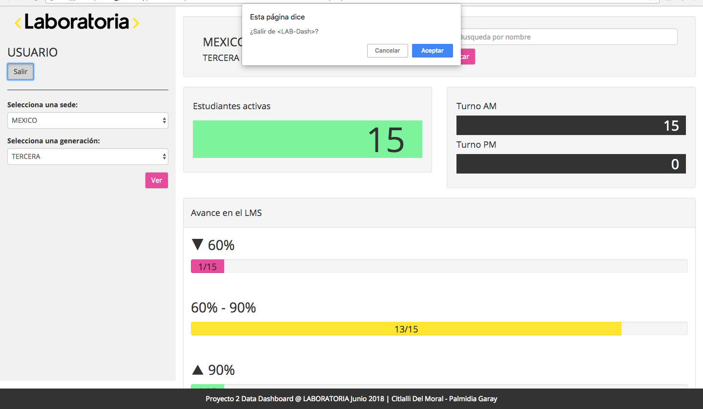

# Data Dashboard

## Introducción

Como **segundo proyecto** del bootcamp de Laboratoria, se planteó el reto de crear por parejas una interfaz donde las TMs  (Training Managers) de las diferentes sedes puedan _ver_ y _usar_ la data de progreso del LMS, siendo este el motivo por el cuál se desarrollo el presente **data dashboard** (_tablero de visualización de datos_).

## Preámbulo

En Laboratoria, las Training Managers (TMs) hacen un gran trabajo al analizar la mayor cantidad de datos posibles respecto al progreso de las estudiantes para apoyarlas en su aprendizaje.

La principal medida de progreso de una estudiante en Laboratoria es su avance completando los proyectos de la [Ruta de Aprendizaje (https://docs.google.com/spreadsheets/d/1AoXQjZnZ5MTPwJPNEGDyvn5vksiOUoPr932TjAldTE4/edit#gid=536983970)
y su desempeño en función a la [Rúbrica de Niveles Esperados](https://docs.google.com/spreadsheets/d/e/2PACX-1vSkQy1waRpQ-16sn7VogiDTy-Fz5e7OSZSYUCiHC_bkLAKYewr4L8pWJ_BG210PeULe-TjLScNQQT_x/pubhtml).

Sin embargo, para completar estos proyectos las estudiantes acceden a contenidos de aprendizaje (lecturas, videos, ejercicios y quizzes) en un sistema llamado LMS (Learning Management System). El LMS acumula data sobre quién
leyó qué, qué ejercicios se han completado, los resultados de los quizzes, etc.

A pesar de que la data de progreso del LMS (ej. lecturas leídas, ejercicios completados, nota en quizzes, etc.) no impacta directamente en la evaluación de una estudiante, sí es una pieza de información relevante que las TMs quisieran visualizar para tener un mejor entendimiento de cómo va cada estudiante en su proceso de aprendizaje.

## Build status

En progreso

- Fase de pruebas del 3er. Sprint

## Code Style

- Standard
- Vanilla Javascript
 
## Screenshots



*Pantalla de Login*




*Pantalla de bienvenida al dashboard con los datos de la sede y generación seleccionados*


*Uso de dropdowns para cambiar de sede y/o generación*




*Ejemplo de listado de estudiantes activas*




*Pantalla de logout*


## Tech/framework usados
Desarrollado con:

-  HTML5
-  CSS3
- Javascript (ES6)
- Bootstrap

## Features

Nuestra propuesta de Dashboard tiene como objetivos principales proporcionar una acceso *fácil* de entender, *rápido* y *cómodo* a la data del desempeño de las alumnas en el LMS de Laboratoria.

La interfaz actual permite al usuario:

* Listar y poder seleccionar sedes
* Dentro de cada sede:
  * Listar y poder seleccionar generaciones
  * Para cada generación, listar y poder seleccionar estudiantes mostrando porcentaje general de completitud de c/estudiante
  * En la vista de cada generación mostrar reporte de:
    * Promedio de la generación
    * Generar status para identificar estudiantes debajo del 60 en su porcentaje de completitud
    * Generar status para identificar estudiantes con 90 o más en su porcentaje de completitud
    * Poder filtrar estudiantes por estos dos status

* Utiliza la interfaz sin problemas desde distintos tamaños de pantallas: móviles, tablets, desktops

* Realizar pruebas unitarias

## Instalación

Para poder utilizar el código, realizar modificaciones o contribuir al proyecto es necesario:

- Tener un editor de textos instalado (Visual Studio Code, Atom, Sublime, etc.)
- Tener instalada una UNIX Shell (En nuestro caso usamos Git Bash)
- Realizar un fork del repositorio
- Clonarlo el fork a la computadora donde se vaya a trabajar
- Tener instalado Node.js
- Instalar las dependencias del proyecto con el comando *npm install*

## Archivos
El *boilerplate* de este proyecto contiene la siguiente estructura de archivos, así como toda la configuración de dependencias y tests:

```text
./
├── .editorconfig
├── .eslintrc
├── .gitignore
├── README.md
├── data 
│   └── laboratoria.json
├── package.json
├── src
│   ├── js
|   |   ├── data.js
│   │   └── main.js
│   ├── cs
│   │   └── style.css
│   ├── img
│   │   └── Laboratoria-Logo-RGB.png
│   └── index.html
└── test
|   ├── data.spec.js
|   ├── fixtures.js
|   ├── headless.js
|   └── index.html
└── ux
    ├── img
    │   └── gif
    │   └── jpg
    │   └── png
    └── README.md
```
La carpeta `data/` dentro del _boilerplate_ incluye un extracto de la data que podemos usar tanto en los tests como en la interfaz en sí. Todos los datos usados son ficticios, y su uso no afecta ni perjudica a ninguna persona o individuo moral.

### Carpeta src

**data.js**
En este archivo se encuentran las funciones que permiten la manipulación de datos a través de arreglos y objetos. Contiene toda la funcionalidad que corresponde a obtener, procesar y manipular datos.

**main.js**
Este archivo contiene todo el código y funciones relacionadas con mostrar en pantalla los datos solicitados por el usuario y obtenidos de las funciones ejecutadas en data.js

**index.html**
Contiene la maquetación base de nuestro sitio y sobre la que se agregan elementos del DOM de acuerdo a las necesidades de la interfaz, también contiene los links a las hojas de estilo y archivos de Javascript que dan estilo y funcionalidad a la página.

**style.css**
Aquí se encuentra todo el código relacionado a los estilos necesarios para todos los elementos de la interfaz

### Carpeta UX

En esta carpeta se encuentra documentado el proceso de diseño realizado para la elaboración de la interfaz, eso incluye la aplicación de entrevistas, encuestas y pruebas de usuario, así como la elaboracion de sketches, wireframes y prototipos.

## Tests

Para correr los test incluidos en el *boilerplate* del proyecto es necesario:

- Tener instalado Node.js
- Instalar las dependencias del proyecto con el comando 

```javascript
npm install
```

- Ejecutar desde la terminal las pruebas unitarias con el comando

```javascript
npm test
```

- Para ver el resultado de las pruebas unitarias en el navegador, se debe ejecutar el comando 

```javascript
npm run test-browser
```

## ¿Cómo usar el Data Dashboard?

Para probar la plataforma actual, se debe contar con acceso a interner e ingresar a la liga: https://citlallidmg.github.io/cdmx-2018-06-bc-core-am-data-dashboard/src/index.html , usando los siguientes datos para loguearse:

- Usuario: *usuario*
- Contraseña: *1234*

También se debe seleccionar en la pantalla de inicio las opciones de acuerdo a la sede y generación que se quiera visualizar al entrar al dashboard.

Una vez dentro se pueden ocupar los diferentes botones para ver los listados de las estudiantes de acuerdo a su turno o avance, la barra de búsquedas para encontrar una estudiante por su nombre o el menú latera para cambiar de sede o generación.

Finalmente, para salir de la plataforma es necesario usar el botón *SALIR* y seleccionar la opción *Aceptar*.

## Colaboradoras

- [Palmidia Garay](https://github.com/jetzable)
- [Citlalli Del Moral](https://github.com/CitlalliDMG)